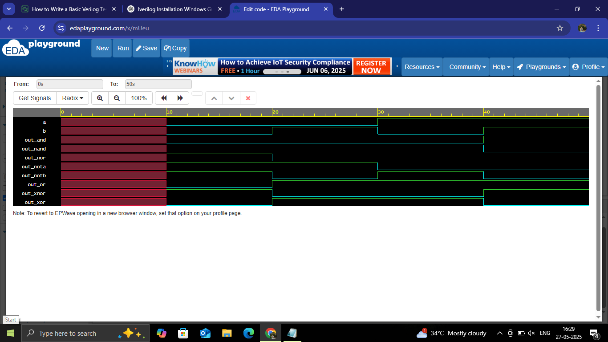

# Basic Logic Gates in Verilog

This project implements basic logic gates (AND, OR, NOT, etc.) using Verilog HDL, developed and simulated on [EDA Playground](https://www.edaplayground.com/).

## 🔧 Files Included

- `basic_gates.v` — Verilog source code for basic gates
- `basic_gates_primitives.v` — Implementation using Verilog built-in primitives
- `basic_gates_tb.v` — Testbench for simulation
- `basic_gates_waveform.png` — Waveform screenshot from GTKWave on EDA Playground

## Simulated On

[EDA Playground](https://www.edaplayground.com/): A free browser-based platform for running Verilog and SystemVerilog code without local installation.

## Waveform Output

